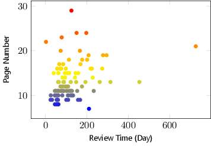

# Analysis of Some Journals

## Introduction
This is a analysis report of some journals where I plan to submit my manuscript to. The list of these journals is shown as follows.

* [Proceedings of the IEEE][POTI],
* [IEEE Transactions on Industrial Electronics][TIE],
* [IEEE Transactions on Industrial Informatics][TII],
* [IEEE Transactions on Information Forensics and Security][TIFS],
* [Safety Science][SS],
* [Annual Reviews in Control][ARIC].

## What is in the Report
In this report, there are:

* brief introduction of each journal,
* distribution of review time,
* distribution of page number,
* scatter of review time and page number,
* some more detail.

## How to Get the Report
This `Reamdme.md` file contains the report. If you want get the `.pdf` file of the report, please clone this repository and compile the `main.tex` file with `xelatex`.

## Notice
Some information of this report is from full papers, but this repository does not contain these full papers. If you want to obtain these full papers, you can use the [BibTeXTools][BibTeXTools] or [JabRef][JabRef] to download them with `.bib` files which are in this repository.

## Report
### Proceedings of the IEEE
> The most highly-cited general interest journal in electrical engineering and computer science, the [Proceedings of the IEEE][POTI] is the best way to stay informed on an exemplary range of topics. This journal also holds the distinction of having the longest useful archival life of any EE or computer related journal in the world! Since 1913, the [Proceedings of the IEEE][POTI] has been the leading journal to provide in-depth tutorial and review coverage of the technical developments that shape our world.

|Year      | Impact Factor | Total Articles | Total Cites|
|:---:     | :---:         | :---:          | :---:      |
|2014/2015 | 4.934         | 102            | 21017      |
|2013      | 5.466         | 154            | 20916      |
|2012      | 6.911         | 195            | 18840      |
|2011      | 6.810         | 118            | 16872      |
|2010      | 5.096         | 139            | 16971      |
|2009      | 4.878         | 129            | 17919      |
|2008      | 4.613         | 122            | 17993      |

There are 182 papers of [Proceedings of the IEEE][POTI] for statistics.

The review time distribution of [Proceedings of the IEEE][POTI] is shown as following figure.

* The minimum review time is 15 Days, 
* The average review time is 162.7923 Days, 
* The maximum review time is 564 Days.

The page number distribution of [Proceedings of the IEEE][POTI] is shown as following figure.

* The minimum page number is 7, 
* The average page number is 17.4809,
* The maximum page number is 63.

The relationship between review time and page number of [Proceedings of the IEEE][POTI] is shown as following figure.

### IEEE Transactions on Industrial Electronics
> [IEEE Transactions on Industrial Electronics][TIE] is published monthly. Its scope encompasses the applications of electronics, controls and communications, instrumentation and computational intelligence for the enhancement of industrial and manufacturing systems and processes. Included are power electronics and drive control techniques, system control and signal processing, fault detection and diagnosis, power systems, instrumentation, measurement and testing, modeling and simulation, motion control, robotics, sensors and actuators, implementation of neural nets, fuzzy logic, and artificial intelligence in industrial systems, factory automation, communication, and computer networks.

Year      | Impact Factor | Total Articles | Total Cites|
:---:     | :---:         | :---:          | :---:      |
2014/2015 | 6.498         | 694            | 27141      |
2013      | 6.500         | 553            | 24432      |
2012      | 5.165         | 470            | 17404      |
2011      | 5.160         | 531            | 15474      |
2010      | 3.439         | 434            | 10294      |
2009      | 4.678         | 505            | 10306      |
2008      | 5.468         | 454            | 9014       |

There are 310 papers of [IEEE Transactions on Industrial Electronics][TIE] for statistics.

The review time distribution of [IEEE Transactions on Industrial Electronics][TIE] is shown as following figure.

* The minimum review time is 11 Days, 
* The average review time is 204.7581 Days, 
* The maximum review time is 597 Days.

The page number distribution of [IEEE Transactions on Industrial Electronics][TIE] is shown as following figure.

* The minimum page number is 3, 
* The average page number is 10.5774, 
* The maximum page number is 16.

The relationship between review time and page number of [IEEE Transactions on Industrial Electronics][TIE] is shown as following figure.

### IEEE Transactions on Industrial Informatics
> [IEEE Transactions on Industrial Informatics][TII] focuses on knowledge-based factory automation as a means to enhance industrial fabrication and manufacturing processes. This embraces a collection of techniques that use information analysis, manipulation, and distribution to achieve higher efficiency, effectiveness, reliability, and/or security within the industrial environment. The scope of the Transaction includes reporting, defining, providing a forum for discourse, and informing its readers about the latest developments in intelligent and computer control systems, robotics, factory communications and automation, flexible manufacturing, visionsystems, and data acquisition and signal processing.

Year      | Impact Factor | Total Articles | Total Cites|
:---:     | :---:         | :---:          | :---:      |
2014/2015 | -             | -              | -          |
2013      | 8.785         | 231            | 2644       |
2012      | 3.381         | 92             | 969        |
2011      | 2.990         | 71             | 739        |
2010      | 1.627         | 63             | 328        |
2009      | 1.614         | 39             | 287        |
2008      | 2.356         | 28             | 227        |

There are 413 papers of [IEEE Transactions on Industrial Informatics][TII] for statistics.

The review time distribution of [IEEE Transactions on Industrial Informatics][TII] is shown as following figure.

* The minimum review time is 1 Day, 
* The average review time is 245.3293 Days, 
* The maximum review time is 877 Days.
* 
The page number distribution of [IEEE Transactions on Industrial Informatics][TII] is shown as following figure.

* The minimum page number is 5,
* The average page number is 11.4092,
* The Maximum page number is 18.

The relationship between review time and page number of [IEEE Transactions on Industrial Informatics][TII] is shown as following figure.

### IEEE Transactions on Information Forensics and Security
> [IEEE Transactions on Information Forensics and Security][TIFS] covers the sciences, technologies, and applications relating to information forensics, information security, biometrics, surveillance and systems applications that incorporate these features.

Year      | Impact Factor | Total Articles | Total Cites|
:---:     | :---:         | :---:          | :---:      |
2014/2015 | 2.408         | 144            | 2376       |
2013      | 2.065         | 176            | 1598       |
2012      | 1.895         | 157            | 1134       |
2011      | 1.340         | 119            | 759        |
2010      | 1.725         | 81             | 682        |
2009      | 2.338         | 81             | 540        |
2008      | 2.230         | 68             | 265        |

There are 123 papers of [IEEE Transactions on Information Forensics and Security][TIFS] for statistics.

The review time distribution of [IEEE Transactions on Information Forensics and Security][TIFS] is shown as following figure.

* The minimum review time is 16 Days,
* The average review time is 196.0488 Days,
* The maximum review time is 428 Days.

The page number distribution of [IEEE Transactions on Information Forensics and Security][TIFS] is shown as following figure.

* The minimum page number is 1,
* The average page number is 12.9512,
* The maximum page number is 27.

The relationship between review time and page number of [IEEE Transactions on Information Forensics and Security][TIFS] is shown as following figure.

### Safety Science
> [Safety Science][SS] serves as an international medium for research in the science and technology of human safety. It extends from safety of people at work to other spheres, such as transport, leisure and home, as well as every other field of man is hazardous activities. [Safety Science][SS] is multidisciplinary. Its contributors and its audience range from psychologists to chemical engineers. The journal covers the physics and engineering of safety; its social, policy and organisational aspects; the management of risks; the effectiveness of control techniques for safety; standardization, legislation, inspection, insurance, costing aspects, human behaviour and safety and the like.

Year      | Impact Factor | Total Articles | Total Cites|
:---:     | :---:         | :---:          | :---:      |
2014/2015 | 1.831         | 230            | 3959       |
2013      | 1.672         | 221            | 3181       |
2012      | 1.359         | 246            | 2393       |
2011      | 1.402         | 159            | 1786       |
2010      | 1.637         | 175            | 1788       |
2009      | 1.220         | 153            | 1274       |
2008      | 0.836         | 114            | 921        |

There are 308 papers of [Safety Science][SS] for statistics.

The review time distribution of [Safety Science][SS] is shown as following figure.

* The minimum review time is 19 Days,
* The average review time is 248.1364 Days,
* The maximum review time is 972 Days.

The page number distribution of [Safety Science][SS] is shown as following figure.

* The minimum page number is 4,
* The average page number is 10.3766,
* The maximum page number is 25.

The relationship between review time and page number of [Safety Science][SS] is shown as following figure.

### Annual Reviews in Control
> [Annual Reviews in Control][ARIC] covers the whole field of control and its applications. Most reviews are selected from the best reviews presented at meetings of IFAC, the International Federation of Automatic Control, re-written and broadened where necessary. The journal also seeks to commission reviews in emerging research areas from leading experts. Suggestions for new review articles should be sent to the Editor or to a member of the Editorial Board. Principal topics include nonlinear control, stochastic theory, discrete events, linear systems, adaptive control, robust control, design and software, system identification, fault detection, real-time programming, robot control, artificial intelligence, man-machine systems, optimization, computer-aided design and intelligent control.

Year      | Impact Factor | Total Articles | Total Cites|
:---:     | :---:         | :---:          | :---:      |
2014/2015 | 2.518         | 20             | 957        |
2013      | 1.878         | 28             | 788        |
2012      | 1.289         | 28             | 662        |
2011      | 1.319         | 21             | 482        |
2010      | 1.884         | 24             | 410        |
2009      | 1.886         | 23             | 441        |
2008      | 1.109         | 20             | 365        |

There are 102 papers of [Annual Reviews in Control][ARIC] for statistics.

The review time distribution of [Annual Reviews in Control][ARIC] is shown as following figure.

* The minimum review time is 2 Days,
* The average review time is 120.4706 Days,
* The maximum review time is 727 Days.

The page number distribution of [Annual Reviews in Control][ARIC] is shown as following figure.

* The minimum page number is 7,
* The average page number is 13.2255,
* The maximum page number is 29.

The relationship between review time and page number of [Annual Reviews in Control][ARIC] is shown as following figure.

 

## Summary

|Journal                                                          | Minimum Review Time | Average Review Time | Maximum Review Time |
| ---                                                             | :---:               | :---:               | :---:               |
|[Proceedings of the IEEE][POTI],                                 | 15                  | 162.7923            | 564                 |
|[IEEE Transactions on Industrial Electronics][TIE],              | 11                  | 204.7581            | 597                 |
|[IEEE Transactions on Industrial Informatics][TII],              | 1                   | 245.3293            | 877                 |
|[IEEE Transactions on Information Forensics and Security][TIFS], | 16                  | 196.0488            | 428                 |
|[Safety Science][SS],                                            | 19                  | 248.1364            | 972                 |
|[Annual Reviews in Control][ARIC].                               | 2                   | 120.4706            | 727                 |

|Journal                                                          | Minimum Page Number | Average Page Number | Maximum Page Number |
| ---                                                             | :---:               | :---:               | :---:               |
|[Proceedings of the IEEE][POTI],                                 | 7                   | 17.4809             | 63                  |
|[IEEE Transactions on Industrial Electronics][TIE],              | 3                   | 10.5774             | 16                  |
|[IEEE Transactions on Industrial Informatics][TII],              | 5                   | 11.4092             | 18                  |
|[IEEE Transactions on Information Forensics and Security][TIFS], | 1                   | 12.9512             | 27                  |
|[Safety Science][SS],                                            | 4                   | 10.3766             | 25                  |
|[Annual Reviews in Control][ARIC].                               | 7                   | 13.2255             | 29                  |

[POTI]:http://ieeexplore.ieee.org/xpl/RecentIssue.jsp?punumber=5 "Proceedings of the IEEE"
[TII]:http://ieeexplore.ieee.org/xpl/RecentIssue.jsp?punumber=9424 "IEEE Transactions on Industrial Informatics"
[TIE]:http://ieeexplore.ieee.org/xpl/RecentIssue.jsp?punumber=41 "IEEE Transactions on Industrial Electronics"
[TIFS]:http://ieeexplore.ieee.org/xpl/RecentIssue.jsp?punumber=10206 "IEEE Transactions on Information Forensics and Security"
[SS]:http://www.journals.elsevier.com/safety-science "Safety Science"
[ARIC]:http://www.journals.elsevier.com/annual-reviews-in-control "http://www.journals.elsevier.com/annual-reviews-in-control/"
[BibTeXTools]:https://github.com/zqmillet/BibTeXTools "BibTeXTools"
[JabRef]:http://www.jabref.org "JabRef"