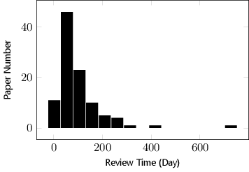
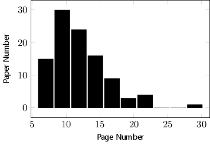

# Analysis of Some Journals

## Introduction
This is a analysis report of some journals where I plan to submit my manuscript to. The list of these journals is shown as follows.

* Proceedings of the IEEE,
* IEEE Transaction on Industrial Electronics,
* IEEE Transaction on Industrial Informatics,
* IEEE Transaction on Information Forensics and Security,
* Safety Science,
* Annual Reviews in Control.

## What is in the Report
In this report, there are:

* brief introduction of each journal,
* distribution of review time,
* distribution of page number,
* scatter of review time and page number,
* some more detail.

## How to Get the Report
This `Reamdme.md` file contains the report. If you want get the `.pdf` file of the report, please clone this repository and compile the `main.tex` file with `xelatex`.

## Notice
Some information of this report is from full papers, but this repository does not contain these full papers. If you want to obtain these full papers, you can use the **BibTeXTools** or **JabRef** to download them with `.bib` files which are in this repository.

## Report
### Proceedings of the IEEE
The review time distribution of Proceedings of the IEEE is shown as following figure.

The page number distribution of Proceedings of the IEEE is shown as following figure.

The relationship between review time and page number of Proceedings of the IEEE is shown as following figure.

### IEEE Transaction on Industrial Electronics
The review time distribution of IEEE Transaction on Industrial Electronics is shown as following figure.

The page number distribution of IEEE Transaction on Industrial Electronics is shown as following figure.

The relationship between review time and page number of IEEE Transaction on Industrial Electronics is shown as following figure.

### IEEE Transaction on Industrial Informatics
The review time distribution of IEEE Transaction on Industrial Informatics is shown as following figure.

The page number distribution of IEEE Transaction on Industrial Informatics is shown as following figure.

The relationship between review time and page number of IEEE Transaction on Industrial Informatics is shown as following figure.

### IEEE Transaction on Information Forensics and Security
The review time distribution of IEEE Transaction on Information Forensics and Security is shown as following figure.

The page number distribution of IEEE Transaction on Information Forensics and Security is shown as following figure.

The relationship between review time and page number of IEEE Transaction on Information Forensics and Security is shown as following figure.

### Safety Science
The review time distribution of Safety Science is shown as following figure.

The page number distribution of Safety Science is shown as following figure.

The relationship between review time and page number of Safety Science is shown as following figure.

### Annual Reviews in Control
The review time distribution of Annual Reviews in Control is shown as following figure.

The page number distribution of Annual Reviews in Control is shown as following figure.

The relationship between review time and page number of Annual Reviews in Control is shown as following figure.

